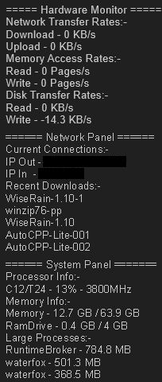

# WiseRain
Status: Working.

## DESCRIPTION
Here is the official Wiseman-Timelord RainMeter skin, yes there is one. This skin is a PowerShell focused skin, flashing powershell scripts on a delay, for lower processing, while utilizing "PowershellRM" plugin. Its an advanced custom rain-meter skin based on powershell scripts with all, of the other things in place and done through the use of cmdlets and built-in windows powershell. I associate it with programs like, Task Monitor or Process Hacker, as I would otherwise likely be gaining such info with such a program.

### FEATURES
- ** Dark Theme **: Designed for dark-themed desktops, where the background is dark and the text is light.
- ** User Friendly **: Use of powershell scripts with clearly commented global variables at the top, for customized readings.
- ** Multi-Panel **: Currently has 3 panels, System and Network and Monitor.
- ** Plugin Enhancement **: Use of "PowershellRM" with, Ps1s and Psd1 (=>v1.02), for enhanced powershell support.
- ** Compatibility **: Supports, IPv4 and truncated IPv6, display of IP address on network panel.
- ** Real-World Units **: Monitoring of, Memory, Disk, Network bandwidth usage rate.

## PREVIEW
- The 3 panels...
 .
- Potential Desktop...
 .

## USAGE
1. Download and Install, the plugin [PowershellRM](https://github.com/khanhas/PowershellRM) into your `Rainmeter/Plugins` folder.
2. Download `Wiseman-Timelords Rainmeter Skin`, and then unpack it to a suitable location.
3. Copy the `WiseRain` folder into your `RainMeter\Skins` folder.
4. Edit the global variables at the top of, ".\system\System.ps1" and ".\network\Netork.ps1", to point to the appropriate locations. If you do not use a Ramdrive, then set the, drive letter and rename the label, to TempDrive D??, failing that, then the SystemDrive C; it should not be left to a dead location, for good practice.
5. Load rain meter or Refresh the skins display, then navigate in the folders in RainMeter, load the 2 panels from `WiseRain` named, `system.ini` and `network.ini`, as you normally would the panels of other skins.   

### UPDATING
- When updating I suggest deleting the old "WiseTime-RM" folder and replacing with the new, as, files and filenames, differ between versions, and yes this will require editing the variables again.

### REQUIREMENTS
1. [RainMeter](https://www.rainmeter.net/) (to load the skin).
2. Powershell => v3.0.
3. [PowershellRM](https://github.com/khanhas/PowershellRM) (plugin for enhanced powershell support).

### NOTATION
- RainMeter will flash up a script, you cannot use loops and variables cannot sustain changes, unless you have some kind of additional script running.
- The three timers, with intervals of 5 seconds, 9 seconds, and 13 seconds, would synchronize every 585 seconds, and with intervals of 7 seconds, 11 seconds, and 15 seconds, then every 1,155 seconds.  
- It is possible to use additional plugins for input on panels.
- It is possible to use rainmeter as a gui for powershell projects.
-  

## Development
Here are some possible directions for development...
1. Cpu Usage seems too high, ensure this is the average for all cores, preferably some simple way to gain this; instead of for first cpu or whatever it is doing.
2. Some kind of notation, top 5 important tasks, short note of for example 5 items with editing/input through plugin.
3. A stripped down version of CreditSight in its own panel, with use of additional plugins there will be input box (CreditSight must be completed first).

### CANCELLATIONS
- Button to enable/disable monitoring, it would require its own panel just to have a button in order for higher refresh, obviously its better to right-click enable/disable monitor.ini. Will re-asses this if there are other new panels added.
- Top 3 bandwidh using apps, this required special libraries to achieve, at least it was not possible through, cmdlets and .net 4.0.

## DISCLAIMER
This software is subject to the terms in License.Txt, covering usage, distribution, and modifications. For full details on your rights and obligations, refer to License.Txt.
